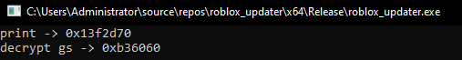
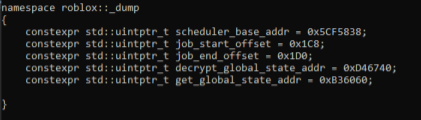
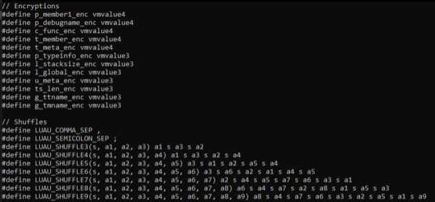

<h1 align="center">
  Grab Offsets Automatically!
</h1>

This is a base designed to teach you how to grab offsets automatically. This project utilizes the [Zydis Disassembler](https://github.com/zyantific/zydis) (yes things other than IDA and Binary Ninja exist, and you can use them in your code!). This project isn't "amazing" or "revolutionary", its a basic concept with LOADS of room for improvement (this was done on purpose so that people hopefully learn how to optimize and improve their code).

### What does this provide you?

Easy! This simple project provides you with example usage of the **Zydis Disassmbler** and shows you how to use it to your advantage. Not only that but I've given (and removed) some custom functions to use with it. You will have to create your own implementations of things such as GetPrologue, GetEpilogue but its not hard I promise.

### Note
This is only as good as your dump, if the dump you provide this offset grabber doesn't have the pages decrypted it won't be able to get them.

### Preview

### Potential

